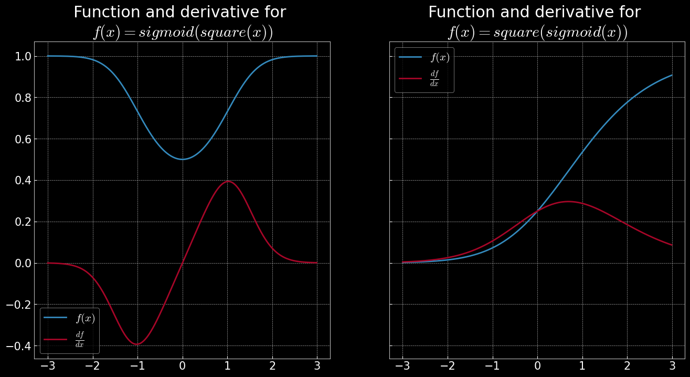

```

                                           d8b 
                                           88P 
                                          d88  
  88bd8b,d88b ?88   d8P       88bd8b,d88b 888  
  88P'`?8P'?8bd88   88        88P'`?8P'?8b?88  
 d88  d88  88P?8(  d88       d88  d88  88P 88b 
d88' d88'  88b`?88P'?8b     d88' d88'  88b  88b
                     )88                       
                    ,d8P                       
                 `?888P'                       

```

# About this repo
Most of them are based on web content
A collection of code that I found useful or interesting

Also check my another repo: https://github.com/TimS-ml/My-ML-From-Scratch




# TODO
- [ ] Quick DL models using built-in dataset
  - [ ] `torchvision.datasets` and `torchtext.datasets`
      - `ImageNet`, `coco`, `pascal voc2012`, `AG_News`
  - [ ] Use small models if possible
- [ ] More topics


# Useful Stuffs
## Open github notebook in colab
https://colab.research.google.com/github/ + repo name
For example: https://colab.research.google.com/github/rasbt/deeplearning-models


# Deep Leanring
- https://github.com/hunkim/PyTorchZeroToAll
- https://github.com/d2l-ai/d2l-zh
- Deep Learning from Scratch Building with Python from First Principles
- https://github.com/eriklindernoren/ML-From-Scratch
  - https://github.com/eriklindernoren/ML-From-Scratch/tree/master/mlfromscratch/deep_learning
- NYU DL
  - https://atcold.github.io/pytorch-Deep-Learning/
  - https://github.com/Atcold/pytorch-Deep-Learning
- https://github.com/geohot/tinygrad/blob/master/tinygrad/tensor.py
- https://github.com/ddbourgin/numpy-ml


# Machine Learning
- cs231 and coursera-ml
- (all in numpy) stat ml method yb hang li
- 100 page ml book
